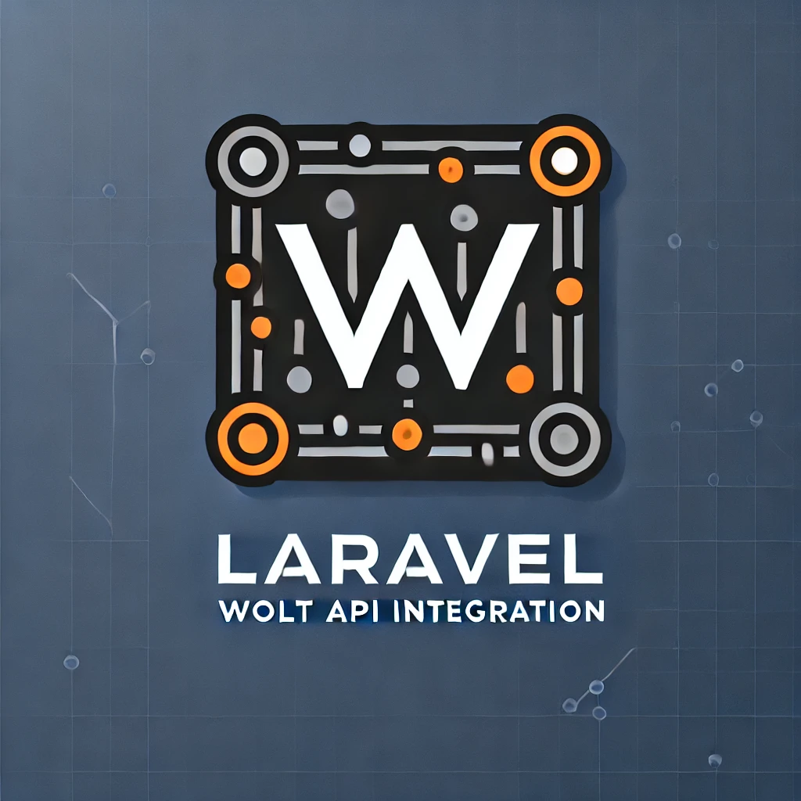

# Laravel Wolt API Integration

🚧 **This package is in development, and is not ready for use in production yet.** 🚧



[](//packagist.org/packages/bored-programmers/wolt)
[](//packagist.org/packages/bored-programmers/wolt)
[](//packagist.org/packages/bored-programmers/wolt)

Wolt is a Laravel package that allows you to integrate your restaurant with the Wolt platform. It provides a simple and easy-to-use API for syncing your menu and managing orders.

## Table of Contents

- [Requirements](#requirements)
- [Installation](#installation)
- [Usage](#usage)
  - [Sync Menu](#sync-menu)
  - [Get Order](#get-order)
  - [Accept Order](#accept-order)
  - [Reject Order](#reject-order)
  - [Mark Order as Ready](#mark-order-as-ready)
  - [Mark Order as Delivered](#mark-order-as-delivered)
  - [Confirm Preorder](#confirm-preorder)
  - [Example](#example)
- [Contribution Guidelines](#contribution-guidelines)
- [Changelog](#changelog)
- [License](#license)
- [Contact Information](#contact-information)
- [Acknowledgments](#acknowledgments)

## Requirements

- PHP 8.1 or higher
- Laravel 10.0 or higher

## Installation

To install Wolt, you need to run the following command:

```bash
composer require bored-programmers/wolt
```

Publish the configuration file and set up your environment variables.

```bash
php artisan vendor:publish --tag=wolt-config
```

Update your `.env` file with the following variables:

```env
WOLT_MENU_API_USERNAME=your_menu_api_username
WOLT_MENU_API_PASSWORD=your_menu_api_password
WOLT_ORDER_API_KEY=your_order_api_key
WOLT_VENUE_ID=your_venue_id
WOLT_IS_SANDBOX=true/false
```

## Usage

### Sync Menu

To sync your menu with Wolt, use the `WoltService::syncMenu` method.

```php
use BoredProgrammers\Wolt\DTO\WoltDTO;
use BoredProgrammers\Wolt\WoltService;

$menuData = new WoltDTO(
    currency: 'EUR',
    primary_language: 'en',
    categories: $categories // This should be an array or collection of CategoryData objects
);

$response = WoltService::syncMenu($menuData);
```

### Get Order

To retrieve an order, use the `WoltService::getOrder` method.  
You will get Order ID from your webhook called by Wolt.  
More about it here: [Wolt Webhook Documentation](https://developer.development.dev.woltapi.com/docs/marketplace-integrations/restaurant-ipad-free#webhook-server).  
I recommend using `spatie/laravel-webhook-client` package for handling webhooks.

```php
use BoredProgrammers\Wolt\WoltService;

$orderId = 'your_wolt_order_id';
$response = WoltService::getOrder($orderId);
```

### Accept Order

To accept an order, use the `WoltService::acceptOrder` method.

```php
use BoredProgrammers\Wolt\WoltService;

$orderId = 'your_wolt_order_id';
$response = WoltService::acceptOrder($orderId);
```

### Reject Order

To reject an order, use the `WoltService::rejectOrder` method.

```php
use BoredProgrammers\Wolt\WoltService;

$orderId = 'your_wolt_order_id';
$response = WoltService::rejectOrder($orderId);
```

### Mark Order as Ready

To mark an order as ready, use the `WoltService::markReadyOrder` method.

```php
use BoredProgrammers\Wolt\WoltService;

$orderId = 'your_wolt_order_id';
$response = WoltService::markReadyOrder($orderId);
```

### Mark Order as Delivered

To mark an order as delivered, use the `WoltService::markDeliveredOrder` method.

```php
use BoredProgrammers\Wolt\WoltService;

$orderId = 'your_wolt_order_id';
$response = WoltService::markDeliveredOrder($orderId);
```

### Confirm Preorder

To confirm a preorder, use the `WoltService::confirmPreorder` method.

```php
use BoredProgrammers\Wolt\WoltService;

$orderId = 'your_wolt_order_id';
$response = WoltService::confirmPreorder($orderId);
```

### Example

Here is an example of how you can use Wolt in your Laravel application:

```php
use BoredProgrammers\Wolt\DTO\WoltDTO;
use BoredProgrammers\Wolt\DTO\CategoryData;
use BoredProgrammers\Wolt\DTO\ItemData;
use BoredProgrammers\Wolt\DTO\LanguageValueData;
use BoredProgrammers\Wolt\DTO\WeeklyAvailability;
use Illuminate\Support\Collection;

// Create LanguageValueData objects
$languageValues = [
    new LanguageValueData('Karamell, Nuss, Vanille', 'de'),
    new LanguageValueData('Caramel, walnut, vanilla', 'en'),
    new LanguageValueData('Sirup - karamel, oříšek, vanilka', 'cs')
];

// Create ItemData objects
$items = [
    new ItemData(
        name: $languageValues,
        options: [],
        price: 19.0,
        image_url: 'https://www.foodiesfeed.com/wp-content/uploads/2023/06/burger-with-melted-cheese.jpg',
        external_data: 'your_internal_id_for_pairing',
        sales_tax_percentage: 0.0,
        enabled: true,
        delivery_methods: [
            WoltDeliveryType::HOME_DELIVERY,
            WoltDeliveryType::TAKEAWAY
        ]
    )
    // Add more ItemData objects as needed
];

// Create WeeklyAvailability objects
$weeklyAvailability = [
    new WeeklyAvailability('6', '07:00', '6', '11:00'),
    new WeeklyAvailability('0', '07:00', '0', '11:00'),
    new WeeklyAvailability('1', '07:00', '1', '11:00'),
    new WeeklyAvailability('2', '07:00', '2', '11:00'),
    new WeeklyAvailability('3', '07:00', '3', '11:00'),
    new WeeklyAvailability('4', '07:00', '4', '11:00'),
    new WeeklyAvailability('5', '07:00', '5', '11:00')
];

// Create CategoryData objects
$categories = [
    new CategoryData(
        items: new Collection($items),
        name: new Collection([new LanguageValueData('Snídaně', 'cs')]),
        weekly_availability: new Collection($weeklyAvailability)
    )
    // Add more CategoryData objects as needed
];

// Create WoltDTO object
$woltDTO = new WoltDTO(
    currency: 'CZK',
    primary_language: 'cs',
    categories: new Collection($categories)
);

// Now $woltDTO is structured as required
```

## Contribution Guidelines

We welcome contributions to Wolt. If you'd like to contribute, please fork the repository, make your changes, and submit a pull request. We have a few requirements for contributions:

- Follow the PSR-2 coding standard.
- Write tests for new features and bug fixes.
- Only use pull requests for contributions.

## Changelog

For a detailed history of changes, see [releases](https://github.com/Bored-Programmers/wolt/releases) on GitHub.

## License

This project is licensed under the [MIT license](https://github.com/Bored-Programmers/wolt/blob/main/LICENSE.md).

## Contact Information

For any questions or concerns, please feel free to create a [discussion](https://github.com/Bored-Programmers/wolt/discussions) on GitHub.

## Credits

Created by [Matěj Černý](https://github.com/LeMatosDeFuk) from [Bored Programmers](https://github.com/Bored-Programmers).

## Acknowledgments

We would like to thank all the contributors who have helped to make Wolt a better package.
